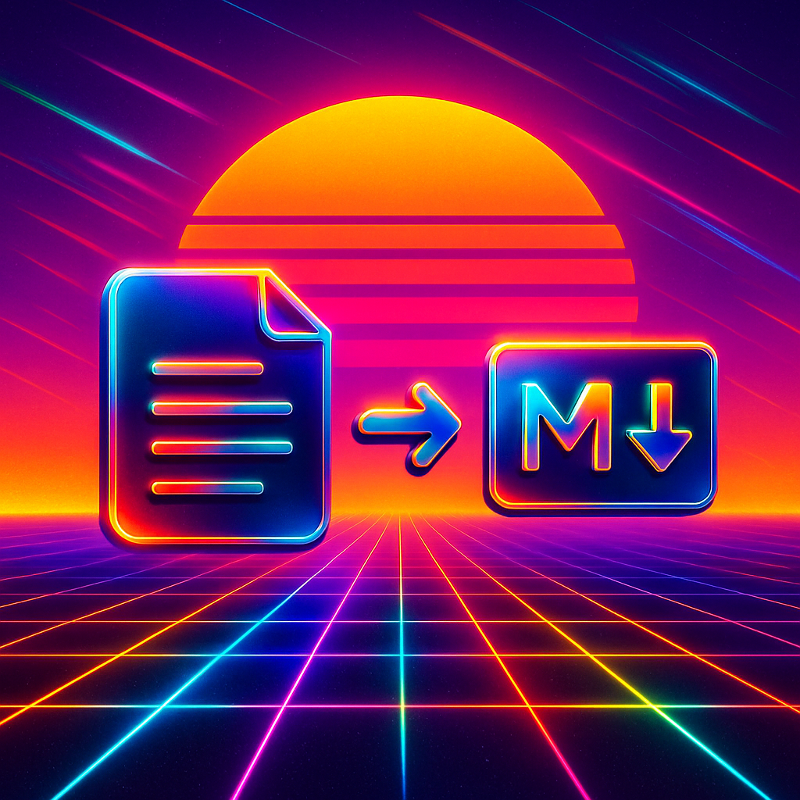

# Local document to markdown formatting using Docling and ..

...

## Prerequisites

- Python 3.12+ 
- pip
- Virtual environment (optional but recommended)

## Installation

...

## Usage

...

## Project Structure

...

## How It Works

...

## License

This project is licensed under the MIT License. See the [LICENSE](LICENSE) file for details.

## Acknowledgements

- [Docling](https://docling.com/) for the document processing framework.